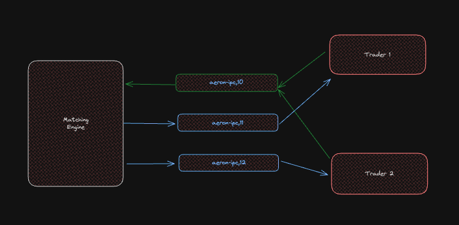
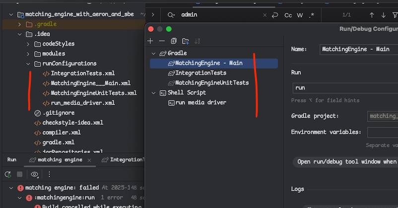

# Aeron Transport, SBE Encoding Examples

This repository demonstrates how to use [Aeron](https://aeron.io/) and [SBE](https://github.com/aeron-io/simple-binary-encoding/wiki/FIX-SBE-XML-Primer) to build Java applications that communicate over the [FIX protocol](https://www.fixtrading.org/).

## Current State
You can run successfully posting new orders both market and limit.
These will get matched and execution reports generated.
This is simulated in IntegrationTests using Aeron to communicate
with MatchingEngine. This is explained later.
Order modify (OCRR) and cancel (OCR) is not yet supported.

## Features

- ✅ Create `NewOrderSingle` (type `D`) and other standard FIX messages
- ✅ Set up **Initiator** (client) and **Acceptor** (server)
- ✅ Send/receive FIX messages over Aeron
- ✅ Use standard FIX fields and custom fields

## Important Issue to Fix before Running
Aeron media driver, Java Main (matching engine), and IntegrationTests must share same shared memory folder.
Just search for /tmp/aeron which is right now in use on Macbook.
On Windows PC you will need to replace with C;\... etc. in all three files.
This is needed in three places, aeron starter i.e. run.sh, Main.java, and IntegrationTests.java.

## How to Run (Steps)
* Start Aeron Media Driver - cd aeron && ./run.sh
* Start Matching Engine - gradle run
* Run IntegrationTests - gradle :matchingengine:test --tests "com.codingmonster.matchingengine.IntegrationTests"

### or just use IntelliJ Run Configuration which I have checked in.
It gives added advantage that you can run in Debug mode.
But don't forget to ensure that aeron.dir is correctly set as per operating system.

#### Start Media Driver
cd aeron
curl -O https://repo1.maven.org/maven2/io/aeron/aeron-all/1.44.0/aeron-all-1.44.0.jar

java \
--add-opens=java.base/sun.nio.ch=ALL-UNNAMED \
-Daeron.dir=/tmp/aeron \
-Daeron.dir.delete.on.start=true \
-Daeron.print.configuration=true \
-Daeron.event.log=true \
-Daeron.client.liveness.timeout=10000000000 \
-Daeron.driver.timeout=60000 \
-cp aeron-all-1.44.0.jar io.aeron.driver.MediaDriver

#### Start Media Driver
See project root build.gradle. You may need to modify based on your OS. Or just do:
`cd aeron`
`./run.sh`

`gradle runMediaDriver`

#### Start Matching Engine
`gradle run`

#### Run Integration Tests
`gradle :matchingengine:test --tests "com.codingmonster.matchingengine.IntegrationTests"`

#### (Optional) SBE Java Code
This is already done and code is checked in.
But in case you want, you could change schema and rerun.

Generate SBE Java Code from xml schema!

`cd common`
`gradle cleanSbeMessages`
`gradle generateMessages`

Schema is in resources/com/codingmonster/common/messages.xml along with the xsd